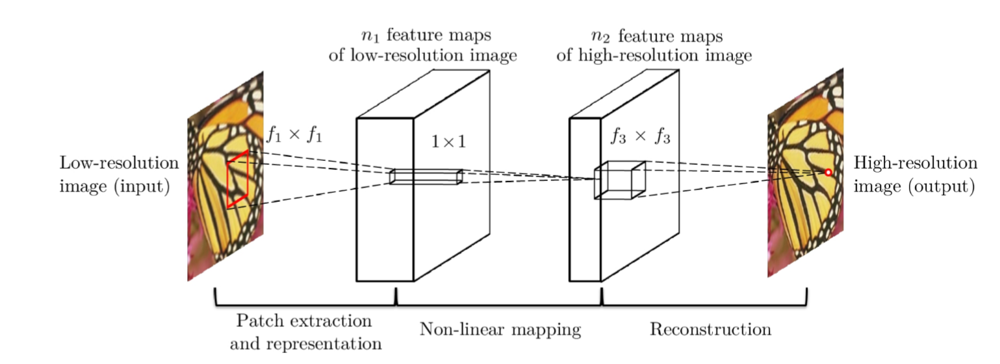
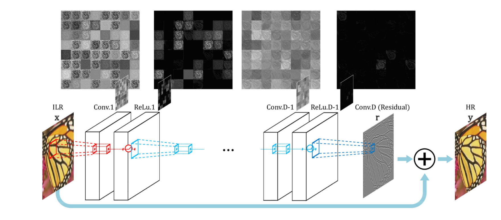

# VDSR 学习

## 原文 

* GitHub: [pytorch-vdsr](https://github.com/twtygqyy/pytorch-vdsr)

* Paper:  [Accurate Image Super-Resolution Using Very Deep Convolutional Networks](http://cv.snu.ac.kr/research/VDSR/)

## Usage

### Requirement

* python3.8
* pytorch1.4
* h5py
* MATLAB

### Evaluation

```shell
python eval.py --cuda --gpus 0
```

### Prepare Training dataset

Download the pictures of [291](https://drive.google.com/open?id=1Rt3asDLuMgLuJvPA1YrhyjWhb97Ly742) to `data/291`.

```shell
cd data
matlab -nodesktop -nosplash -r generate_train_h5
```

### Train

```shell
python main_vdsr.py --cuda --gpus 0
```

### Test

```shell
python eval.py --cuda --gpus 0 --model checkpoints/...
```

## VDSR细节



|         | SRCNN                        | VDSR                   |
| ------- | ---------------------------- | ---------------------- |
| patch   | $33\times33$                 | $41\times41$, 数据增强 |
| padding | no padding                   | pad zeros              |
| lr      | $10^{-4},10^{-4},10^{-5}$    | $10^{-4}$              |
| conv    | $9\times9,1\times1,5\times5$ | $3\times3$             |



* SRCNN主要解决的问题：用CNN解决SR问题。但是它只用了3层的网络
* VDSR主要解决的问题：用深层的网络（20层）解决SR问题

* 除此以外，VDSR使用了数据增强，统一的学习率和卷积层

* 数据增强：多次缩放(1,0.7,0.5)，多次旋转(3次)，重叠的取patch(这里没取重叠)，不随机，而是全都要

* YCbCr：主流的单通道SR问题都是训练Y通道，CbCr通道Bicubic。如果要三通道一起训练考虑训练RGB三个通道

* DeConv未采用，这不一定是件坏事，因为VDSR是可以同时对2,3,4(以及更多)倍一起训练的
* label: 数据增强后生成的patch, 大小是(41,41)
* input: Bicubic到1/scale后Bicubic到scale，再取如同label一样取patch

